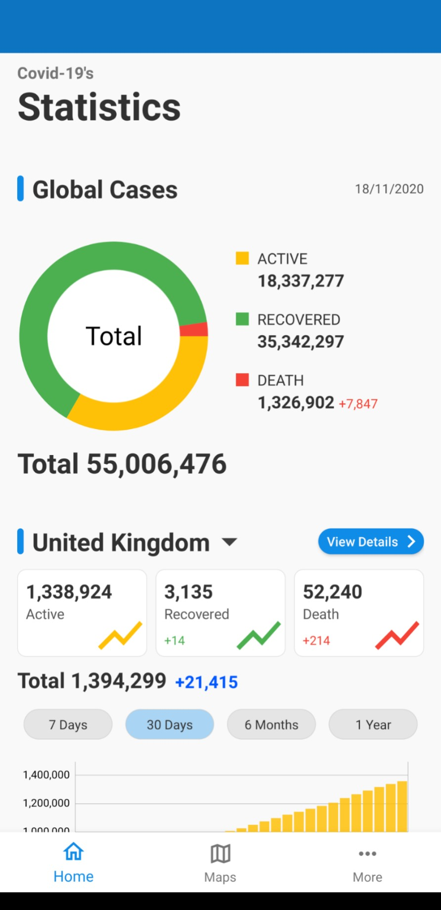
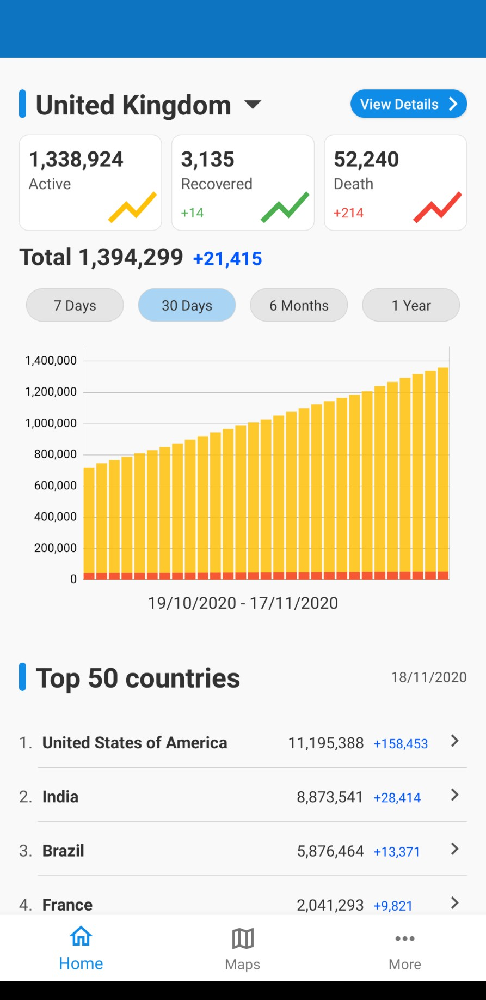
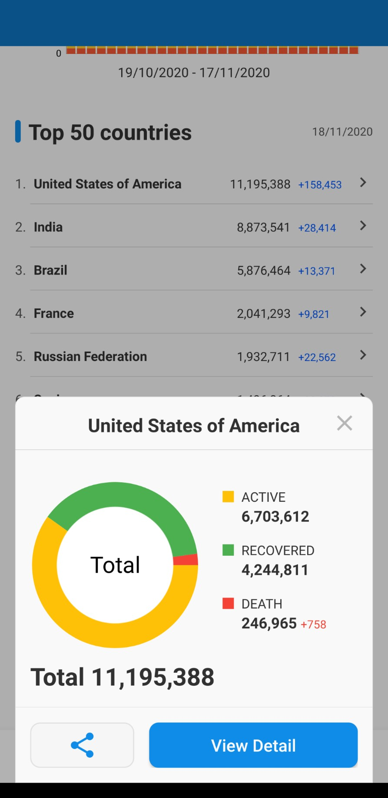
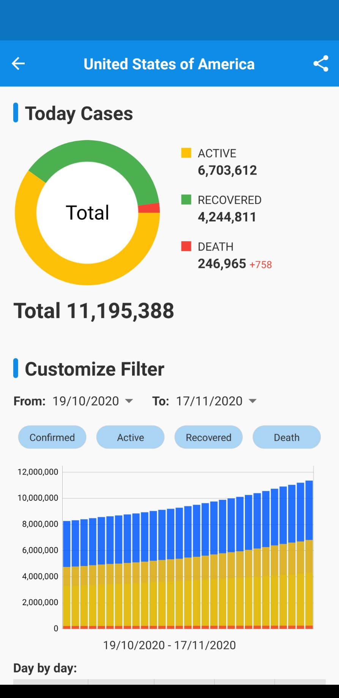
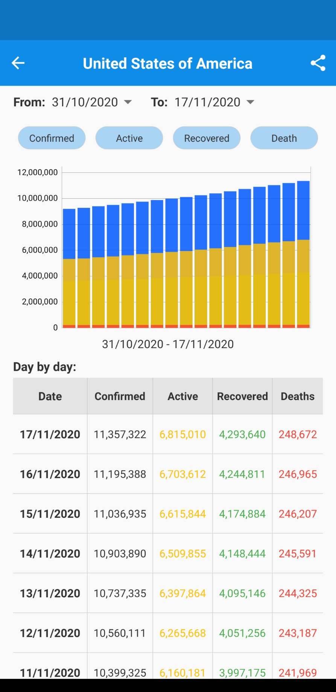
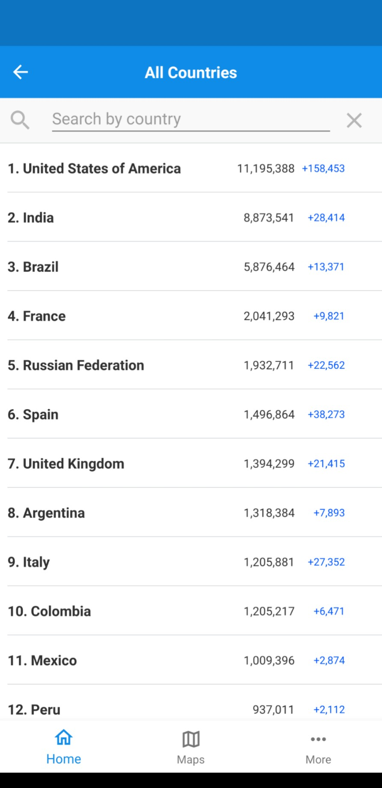
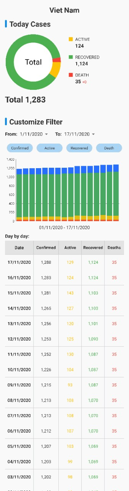
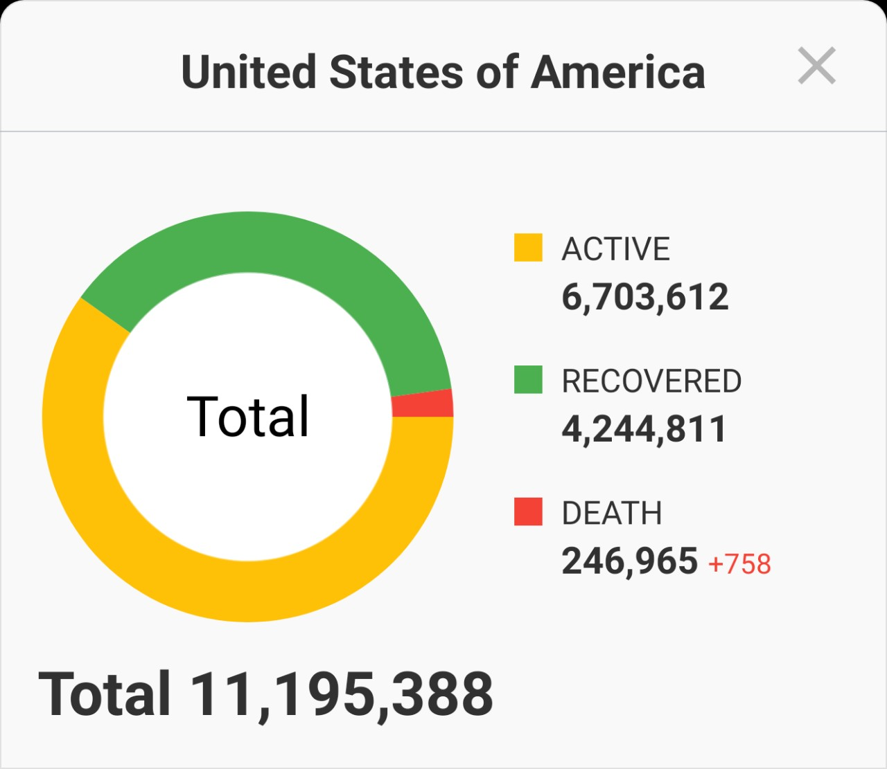

# Covid-19 Statistics App - Android Tech Test
From the XX Engineering Department we want to improve the current visibility of Covid-19 and for that purpose we want to build a new mobile application using the public API from covid19api (​https://covid19api.com/​).

## About This Project
In this project I am building a Covid-19 Statistics App by using the FREE API data from [Covid-19 API](https://documenter.getpostman.com/view/10808728/SzS8rjbc).
- The user can view the statistics of number of cases in the Global and any country that user can select. 
- Able to view the statistics data in Chart & Text information. 
- Able to filter by country, status (confirmed, recovered, active, death) or a range of the time. 
- Able to share the statistics for viewing as an image.

## App Features
* Show the cases in Global updated by today
* Show the cases in Vietnam (default) or able to view other countries by search feature
* View statistics in chart view, list view
* View top 50 countries in the list & quick preview, or all countries
* View the country's statistics in detail
* Share the country's statistics as an image
* Map: view in Maps the live cases <b><= Just an idea. Not implemented yet</b>
* More: view in-app settings <b><= Just an idea. Not implemented yet</b>

## Setting Up
Step-1 : Download project at 'stable' branch

Step-2 : Sync project's gradle and clearn the project

Step-3 : Compile & Run the project on Android 7.0++

## App Demo
<table>
  <tr>
    <td align="center">
      Home Screen - Global 
      
    </td>
    <td align="center">
      Home Screen - Selected Country 
      
    </td>
    <td align="center">
      Home Screen - Top 50 Countries 
      
    </td>
  </tr>

  <tr>
    <td align="center">
      Country Details Screen - Top 
      
    </td>
    <td align="center">
      Country Details Screen - Filter 
      
    </td>
    <td align="center">
    </td>
  </tr>

  <tr>
    <td align="center">
      Search Screen 
      
    </td>
    <td align="center">
    </td>
    <td align="center">
    </td>
  </tr>

  <tr>
    <td align="center">
      Share Long Content as an image 
      
    </td>
    <td align="center">
      Share Short Content as an image 
      
    </td>
    <td align="center">
    </td>
  </tr>

</table>

## Library Used
* [Android Recommended Architecture - MVVM](https://developer.android.com/jetpack/guide#recommended-app-arch)
* [Live Data](https://developer.android.com/topic/libraries/architecture/livedata)
* [Retrofit](https://square.github.io/retrofit/)
* [Covid-19 API](https://documenter.getpostman.com/view/10808728/SzS8rjbc)
* [MPAndroidChart](https://github.com/PhilJay/MPAndroidChart)

## Improvement
* Unit test should be have
* Data caching:
  * Reuse data from API for few minutes to reduce APIs called when user refresh/relaunch 
  * Reuse previous data loaded, and load new data in background at launching time. To improve the UX

# Author
* [Linkedin](https://www.linkedin.com/in/soantrinh/)
